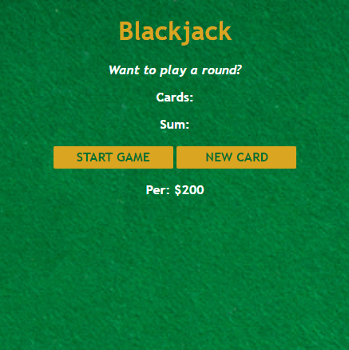

# Blackjack-Game

 [Live Project Here](https://hayfordz.github.io/Blackjack-Game/)

---

### Table of Contents

- [Description](#description)
- [Technologies](#Technologies)
- [How To Use](#how-to-use)
- [License](#license)
- [Author Info](#author-info)

---

## Description

Blackjack is a casino banked game, meaning that players compete against the house rather than each other. The objective is to get a hand total of closer to 21 than the dealer without going over 21 (busting).
At the start of a Blackjack game, the players and the dealer receive two cards each. The player may request additional cards until he reaches or surpasses 21.

#### Technologies

- JavaScript
- CSS
- HTML

[Back To The Top](#Blackjack-Game)

---

## How To Use
 After the first page loads
 Click on the START GAME button to begin
 After the two cards are drawn, you may draw 
 another card by clicking on the NEW CARD BUTTON
 This is only possible if you have not reached
 or surpased 21.

## License

MIT License

Copyright (c) [2021] [Hayford Osei Donkor]

Permission is hereby granted, free of charge, to any person obtaining a copy
of this software and associated documentation files (the "Software"), to deal
in the Software without restriction, including without limitation the rights
to use, copy, modify, merge, publish, distribute, sublicense, and/or sell
copies of the Software, and to permit persons to whom the Software is
furnished to do so, subject to the following conditions:

The above copyright notice and this permission notice shall be included in all
copies or substantial portions of the Software.

THE SOFTWARE IS PROVIDED "AS IS", WITHOUT WARRANTY OF ANY KIND, EXPRESS OR
IMPLIED, INCLUDING BUT NOT LIMITED TO THE WARRANTIES OF MERCHANTABILITY,
FITNESS FOR A PARTICULAR PURPOSE AND NONINFRINGEMENT. IN NO EVENT SHALL THE
AUTHORS OR COPYRIGHT HOLDERS BE LIABLE FOR ANY CLAIM, DAMAGES OR OTHER
LIABILITY, WHETHER IN AN ACTION OF CONTRACT, TORT OR OTHERWISE, ARISING FROM,
OUT OF OR IN CONNECTION WITH THE SOFTWARE OR THE USE OR OTHER DEALINGS IN THE
SOFTWARE.

## Author Info

- Twitter - [@Hayford_Codes](https://twitter.com/Hayford_Codes?s=09)

- LinkedIn- [Hayford Osei Donkor](https://www.linkedin.com/in/hayford-osei-donkor-334b5218a)

[Back To The Top](#Blackjack-Game)
